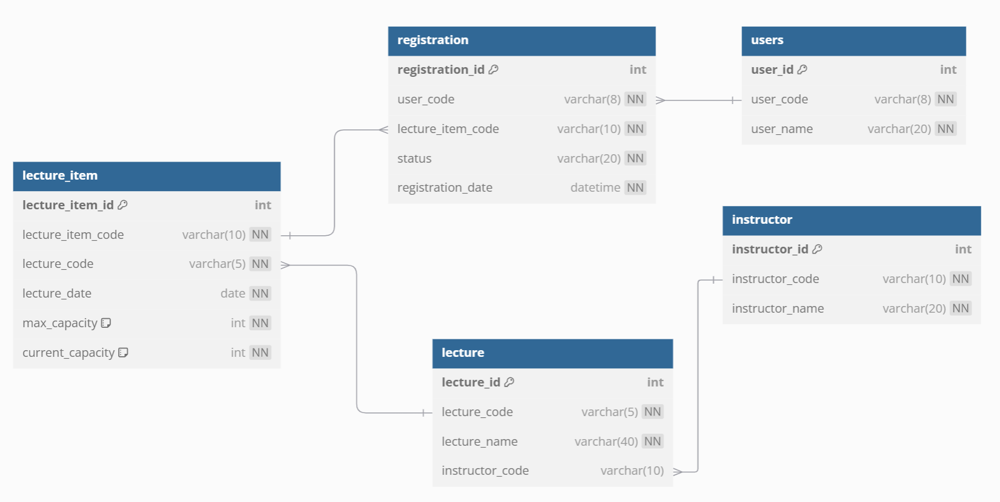

## ERD Diagram


### lecture
특강에 대한 기본 정보 저장<br>
`lecture_code` - 특강 고유 식별 코드<br>
`lecture_name` - 특강명<br>
`instructor_code` - 강사

### lecture_item
각 특강의 일정 정보 저장<br>
`lecture_item_code` - 각 특강 일정 식별 코드<br>
`lecture_code` - 어떤 특강에 대한 일정인지 구분을 위한 코드<br>
`lecture_date` - 특강 일자<br>
`max_capacity` - 최대 정원<br>
`current_capacity` - 수강 신청 인원

### instructor
강사 정보 저장<br>
`instructor_code` - 강사 고유 식별 코드<br>
`instructor_name` - 강사명

### users
사용자 정보 저장<br>
`user_code` - 사용자 고유 식별 코드<br>
`user_name` - 사용자 이름

### registration
사용자가 신청한 특강 일정 저장<br>
`user_code` - 사용자 고유 식별 코드<br>
`lecture_item_code` - 어떤 특강을 신청했는지 확인 코드<br>
`status` - 신청 상태<br>
`registration_date` - 신청한 날짜


```sql
CREATE TABLE instructor (
    instructor_id INT AUTO_INCREMENT PRIMARY KEY,
    instructor_code VARCHAR(10) NOT NULL UNIQUE,
    instructor_name VARCHAR(20) NOT NULL
);

CREATE TABLE lecture (
    lecture_id INT AUTO_INCREMENT PRIMARY KEY,
    lecture_code VARCHAR(5) NOT NULL UNIQUE,
    lecture_name VARCHAR(40) NOT NULL,
    instructor_code VARCHAR(10),
    FOREIGN KEY (instructor_code) REFERENCES instructor(instructor_code)
);

CREATE TABLE lecture_item (
    lecture_item_id INT AUTO_INCREMENT PRIMARY KEY,
    lecture_item_code VARCHAR(10) NOT NULL UNIQUE,
    lecture_code VARCHAR(5) NOT NULL,
    lecture_date DATE NOT NULL,
    max_capacity INT NOT NULL DEFAULT 30,
    current_capacity INT NOT NULL DEFAULT 0,
    FOREIGN KEY (lecture_code) REFERENCES lecture(lecture_code)
);

CREATE TABLE registration (
    registration_id INT AUTO_INCREMENT PRIMARY KEY,
    user_code VARCHAR(8) NOT NULL,
    lecture_item_code VARCHAR(10) NOT NULL,
    status VARCHAR(20) NOT NULL,
    registration_date DATETIME NOT NULL,
    FOREIGN KEY (user_code) REFERENCES users(user_code),
    FOREIGN KEY (lecture_item_code) REFERENCES lecture_item(lecture_item_code)
);

CREATE TABLE users (
    user_id INT AUTO_INCREMENT PRIMARY KEY,
    user_code VARCHAR(8) NOT NULL UNIQUE,
    user_name VARCHAR(20) NOT NULL
);

```

### 위와 같은 구조를 선택한 이유
1. 명확한 관계 설정
- 사용자(User)와 등록(Registration)은 1:n 관계. (사용자는 여러 특강에 등록 가능)
- 강사(Instructor)와 특강(Lecture)은 1:n 관계. (강사는 여러 특강을 할 수 있음)
- 특강(Lecture)와 특강 일정(LectureItem)은 1:n 관계 (하나의 특강은 여러번 진행 가능)

2. 데이터 무결성
- 외래 키 제약 조건의 사용으로 참조 무결성 보장 및 잘못된 데이터 삽입 방지.

3. 단방향 사용
- 강사 → 특강 → 특강 일정
- 사용자 → 등록(사용자 정보 참조) → 특강
관계를 명확히 하여 서로 어떤 테이블을 참조하는지 파악 가능

4. 관리 용이
- 필요한 데이터를 쉽게 조합할 수 있음
